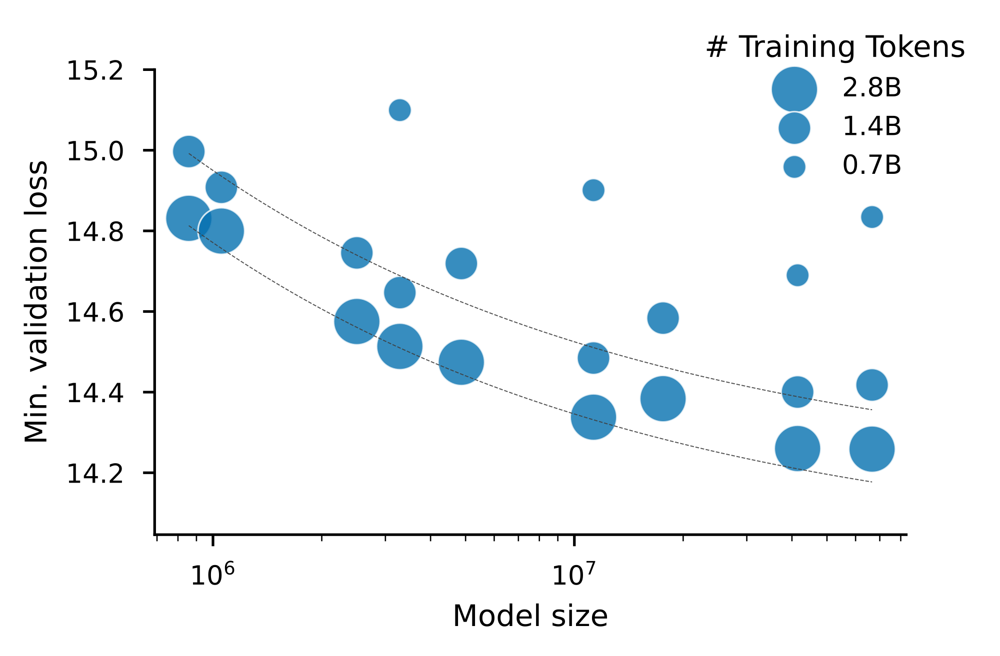
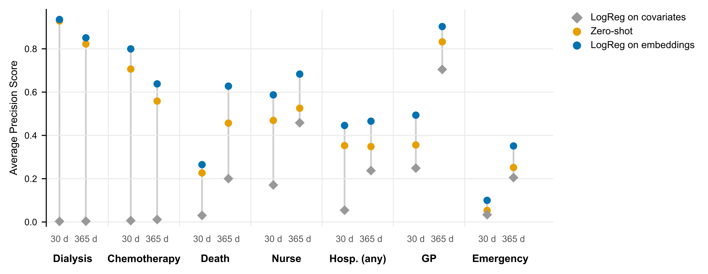
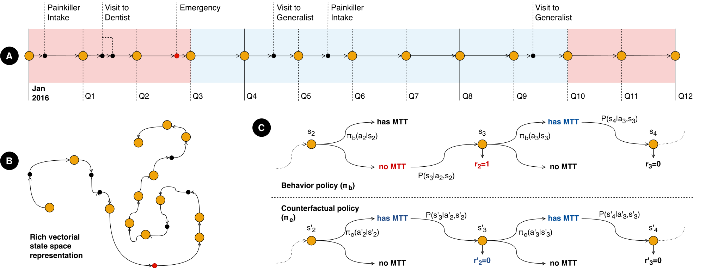
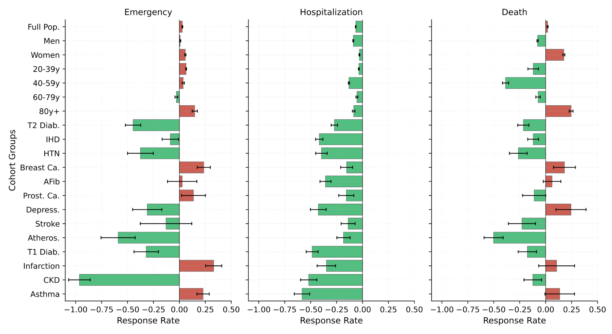
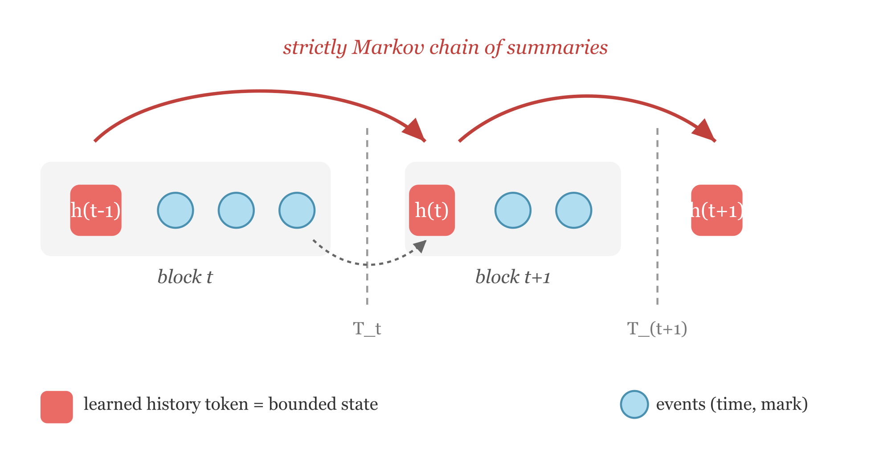

::: {.callout-note appearance="simple"}
The slides presented at the committee are available [here](https://meilame-tayebjee.github.io/G4H-Report/mydocs/csi_slides_2/).
:::

# Introduction {#sec-intro}

## Context

This PhD in computer science started in September 2024. I work on it part-time alongside my position as a data scientist at Insee's AI & Data Science Innovation Lab. It is part of the **Graph4Health** ANR project, which studies how the supply of healthcare, and its geographic distribution, affects health outcomes, and which policies could make the French healthcare system more efficient. The project uses classical econometric tools and deep learning methods on 11 years of the exhaustive SNDS: about 70 million patients, with their consultations, procedures, hospital stays, medications and deaths.

My part of the project is methodological. Downstream causal estimators need each patient's history as a fixed-size vector, together with a treatment and an outcome. Medical pathways are hard to turn into such vectors. They are **unstructured**, like text (sequences of codes from several administrative classifications), but **irregular in time**, unlike text (gaps range from zero to several years), and many events **share a timestamp** (a pharmacy delivery or a hospital stay emits several codes at once).

The thesis therefore builds a *foundation model* of medical pathways whose representations summarise a patient's history *at any date*, plugs them into causal and policy estimators, and studies what the estimators need from them. Our running application is the *médecin traitant* (declared primary care provider, PCP). Every year about 1,000 French GPs retire or die, and each is the PCP of about 1,000 patients.

## How the project evolved {#sec-evolution}

@tbl-evolution compares the state of the project at the first committee (October 2025) with its state today. It also lists what comes next (@sec-future). The thesis title changed from *Embedding medical pathways for causal inference on healthcare supply shocks and patient outcomes* to *Policy evaluation using Transformer-based medical pathway embeddings*. The change reflects the main shift of the year: from a one-shot treatment effect to the evaluation of a **sequential policy**.

| | End of year 1 (Oct. 2025) | End of year 2 (now) | Next (@sec-future) |
|---|---|---|---|
| **Data** | Consultations and medications | Adds procedures, hospital stays (ICD-10 and DRG codes), emergencies, deaths and long-term conditions: about 7,200 tokens | Data-driven vocabulary (ZipfTok) |
| **Pre-training** | Does each token appear within 14, 30, 90 or 180 days? (binary cross-entropy with a monotonicity penalty) | Generative: multi-label next event and time to next event | Discrete-time competing risks (DCR) |
| **Validation** | ROC curves on the pre-training task; 5M- and 40M-parameter models | Scaling law, time calibration, zero-shot and probed prediction, embedding space | Controlled benchmarks (synthetic data, MIMIC-IV) |
| **Causal use** | Planned: CATE of PCP loss with S- and R-learners | Done: doubly robust off-policy evaluation on about 50M patients | A state that is Markov by construction (MarBLE) |

: The project at the first committee, today, and next. {#tbl-evolution tbl-colwidths="[13,27,32,28]"}

Two lessons from the first year shaped the second. **The pre-training task** (does a code appear within fixed horizons?) converged quickly even at small size, suggesting it was too easy, and it gave no generative model; we replaced it with a next-event task that handles simultaneous events (@sec-gpt). **The causal question** is sequential: patients lose a PCP, go without one, then declare a new one, so a static conditional average treatment effect (CATE) with a single treatment date misses the point. With Lucas Resende (CREST), we recast "what if every patient had a PCP?" as **off-policy evaluation** (OPE) in a Markov decision process (@sec-ope).

# A generative foundation model of French medical pathways {#sec-gpt}

## Data and model

We observe patients $i = 1, \dots, n$, each described by $X_i \coloneqq (e_i, t_i, f_i)$: the sequence of tokenised events $e_i$, their dates $t_i$, and static features $f_i$ (age class, sex). The vocabulary has 83 consultation specialties, 936 CCAM procedure codes, 704 ATC medication codes, 3,275 ICD-10 hospital-entry codes, 1,110 DRG hospital-exit codes, one emergency token, one death token, and 1,111 long-term condition (ALD) tokens.

The model is a **decoder-only (GPT-like) Transformer**. Tokens, age and sex have their own embedding matrices. A special [START] token is the sum of the age and sex embeddings. The dates $t_i$ enter through a sinusoidal positional encoding, which makes the model *time-aware*. With causal self-attention, the output $\mathrm{GPT}_\theta(X_i)$ is a sequence of contextualised embeddings in which each position depends only on the past. One forward pass therefore gives the patient's representation at every date, which is what longitudinal estimators need.

## Pre-training objective

With weight tying, the output at position $c$ gives an intensity $\lambda_{i,c,v} > 0$ for each token $v$. Delphi [@Shmatko2025] uses a softmax over tokens. Instead, we use a **multi-label** loss, so that events sharing a timestamp do not compete for probability mass:
$$
\mathrm{BCE}_{i,c} \coloneqq -\sum_{v} \Big[ y_{i,c,v} \log \frac{\lambda_{i,c,v}}{1+\lambda_{i,c,v}} + (1-y_{i,c,v}) \log \frac{1}{1+\lambda_{i,c,v}} \Big].
$$
We combine it with Delphi's exponential **time-to-next-event** loss, $\mathrm{TTE}_{i,c} \coloneqq -\log \sum_v \lambda_{i,c,v} + t^\star \sum_v \lambda_{i,c,v}$, where $t^\star$ is the observed waiting time. The resulting model is generative: we can sample the next event and its date, and repeat.

## Validation

Our validation has four parts.

- **Scaling law.** Validation loss decreases as a power law in model size and in data volume (@fig-scaling). The best ratio of training tokens to parameters is about 2,000, close to what @coMET report on US medical event data, and far from the ratio of 20 found for language models [@chinchilla].
- **Embedding space.** A UMAP projection of the token embeddings forms interpretable clinical clusters. The model learned them from co-occurrence patterns alone, without any clinical labels.
- **Time calibration.** The expected time to the next event closely matches the observed time.
- **Prediction.** We sampled each held-out patient's embedding at a random date and predicted seven clinical events at 30 and 365 days (@fig-aps, 100,000 held-out patients). The zero-shot model is far above an age-and-sex baseline. Linear probes on the frozen embeddings improve on it further, for example from about 0 to 0.8 average precision for chemotherapy at 30 days.

{#fig-scaling width="46%"}

{#fig-aps width="80%"}

# Use case: off-policy evaluation of PCP assignment {#sec-ope}

## Framework

We model each patient's care as a finite-horizon Markov decision process. The period covers two years (2017–2018), cut into $T+1 = 8$ quarters. At quarter $t$, the **state** is
$$
s_t = \big[\phi_t^\top,\ \mathbf{m}_t^\top,\ \mathbf{d}_t^\top,\ \mathbf{o}^\top\big]^\top,
$$
where $\phi_t$ is the GPT embedding of the patient's history up to $t$, $\mathbf{m}_t \in \{0,1\}^4$ records PCP affiliation over the last four quarters, $\mathbf{d}_t$ measures local healthcare supply (density of active physicians in the municipality or within a 10-minute drive), and $\mathbf{o}$ is the patient's cohort (one-hot).

The **action** $a_t$ is whether the patient has a PCP at the start of the next quarter. The **reward** $r_t$ is the number of emergency visits (or hospital admissions, or death) in that quarter. The data come from an unknown behaviour policy $\pi_b$. We estimate the value of a target policy that assigns a PCP with probability $0.99$, $\pi_e(1 \mid s_t) \coloneqq 0.99$ (@fig-mdp).

{#fig-mdp width="76%"}

## Doubly robust estimation

We use the doubly robust (DR) estimator of @kallus2020double. It remains consistent if *either* of its two nuisance functions is well estimated: the **state–action value** $q_t(s,a)$, the expected future return under $\pi_e$, or the **marginalised density ratio** $\mu_t(s,a)$, the expected product of the ratios $\pi_e/\pi_b$ up to time $t$. We estimate them as follows.

- **Behaviour policy.** We estimate $\hat\pi_b$ with a binary classifier on $s_t$.
- **Density ratio.** We fit a single $\hat\mu$ by regressing the cumulative importance weights on $(t, s_t, a_t)$, rather than one model per quarter.
- **Value function.** We fit $\hat q_t$ backwards from $t = T$. At each step, we regress the pseudo-outcome $r_t + \sum_a \pi_e(a \mid s_{t+1})\,\hat q_{t+1}(s_{t+1}, a)$ on $(s_t, a_t)$. We use a Poisson loss for counts and binary cross-entropy for death.
- **Cross-fitting.** We split about 50M individuals into $K = 100$ folds and fit one pair $(\hat q^k, \hat\mu^k)$ per fold. Each individual's nuisances are the median over the models fitted on the other folds [@chernozhukov2018double]. The GPT embeddings follow the same split.

For each individual, this gives an influence-function value $\psi_i$. The policy value is estimated by $\hat\rho_{\pi_e} = \frac1N \sum_i \psi_i$, with standard error $\hat\sigma_\psi/\sqrt N$, so no bootstrap is needed.

## Results

{#fig-ope width="52%"}

The out-of-fold diagnostics are satisfactory: $\hat\pi_b$ is well calibrated, observed deaths concentrate in the top deciles of $\hat q_7$, and, after biological sex, the GPT history embeddings are the most important predictors. The policy estimates (@fig-ope) vary across subgroups. **Hospital admissions** decrease in almost every subgroup. **Emergency visits** decrease most for patients with chronic conditions (kidney disease, atherosclerosis, diabetes, hypertension) and increase for others (over-80s, myocardial infarction, breast cancer, asthma). The effect on **death** is heterogeneous. These results are part of a joint working paper on primary care gatekeeping [@resende2026gatekeeping].

**What this application taught us.** The whole pipeline relies on an assumption we cannot check: that $s_t$ is **Markov**, i.e. that given $s_t$, the future is independent of the past. The DR estimator, the backward recursion and the sequential ignorability condition all require it [@shi2020testing; @gottesman2019guidelines]. A causal Transformer gives no such guarantee: its representation at $t$ depends on the entire past, and $\phi_t$ is only a lossy read of it. The application also exposed two issues in the foundation model itself. The treatment of simultaneous events was ad hoc. The vocabulary was inherited from administrative classifications, with arbitrary truncations. These three issues define the work for the rest of the PhD.

# Ongoing and future work {#sec-future}

## MarBLE: a Markovian state for event sequences

**Goal.** MarBLE (*Markovian Bottlenecks with backward Likelihood reconstruction for temporal Event sequences*) wraps any decoder-only backbone so that its state is Markov **by construction**. It is joint work with Lucas Resende. We split the timeline into blocks at chosen boundaries (a quarter, a hospital admission). Each block $t$ starts with a learned **history token**: $B_t' = (h_{t-1}, e_{t,1}, \dots, e_{t,k_t})$ (@fig-marble). After the block, a gated update produces the next summary $h_t$ from $h_{t-1}$ and the block's last contextualised position.

{#fig-marble width="38%"}

**Method.** MarBLE has two components.

- **Block-diagonal mask.** No event in block $t$ may attend to anything before $h_{t-1}$. As a result, $h_{t-1}$ is the only path from the past, and $h_t$ is a deterministic function of $(h_{t-1}, B_t)$. For *any* data distribution, $h_0 \to h_1 \to \cdots$ is therefore a Markov chain (**predictive sufficiency**). The forward loss is the same point-process likelihood as our GPT.
- **Discounted backward reconstruction (DBR).** A forward loss alone lets $h_t$ discard any past that does not help predict the future. DBR adds a decoder that reconstructs each block's recency-discounted count for each token $v$, $\tilde c_v = \sum_{j: y_j = v} e^{-\beta u_j}$, where $u_j$ is the backward age of event $j$. Its loss is an exact closed-form marked-Poisson likelihood, computed in $O(V)$ with zero variance (**retrospective sufficiency**). Unlike memory-token architectures [@bulatov2022rmt; @karpukhinHTTransformerEventSequences2025], the chain is strictly Markov and the summary is trained to be readable.

**First results.** On synthetic streams with known Bayes-optimal quantities, an unconstrained GPT recovers the latent state from its block-end token at 0.670 accuracy (ceiling 0.686), but drops to 0.591 when restricted at inference to MarBLE's information $\{h_{t-1}, B_t\}$, barely above the single-block level of 0.565: **its block-end token is not a state**. The same backbone *trained* under the mask reaches 0.669 through its bounded summary, at no forward-loss cost. DBR makes the summary keep the past when prediction does not reward it: on an i.i.d. control stream, recall of the previous block goes from chance (0.147) to 0.581.

On **MIMIC-IV** [@johnson2023mimiciv], with one block per admission and a shared 14.6M-parameter backbone, the mask *improves* forward likelihood over Delphi. Frozen linear probes at admission boundaries (@tbl-marble) show that MarBLE's summary is much better at reconstructing the admission it just closed and at forecasting the next one. It is worse at recovering static attributes such as sex, which the chain has no reason to carry. This is the expected cost of a Markov bottleneck.

| Frozen probe at an admission boundary | Delphi | MarBLE (mask) |
|---|:-:|:-:|
| Length of stay of the closed admission ($R^2$) | 0.50 | **0.82** |
| Gap to the next admission ($R^2$) | 0.02 | **0.12** |
| 30-day readmission (AUROC) | 0.57 | **0.65** |
| Sex (AUROC) | **0.83** | 0.72 |

: Frozen probes on MIMIC-IV (2,687 admissions shared by all models). Excerpt from the MarBLE paper draft. {#tbl-marble}

**Next steps.** We will write the section on plugging $h_t$ into the OPE estimator, then submit the paper. We then plan to train MarBLE on the SNDS with quarterly blocks, so that $h_t$ replaces $\phi_t$ in the state of @sec-ope. The Markov assumption behind the policy estimates would then hold by construction.

## A pre-training objective for simultaneous events

**Motivation.** Most event-stream foundation models (Delphi, ETHOS, MOTOR) train on a point-process likelihood: a continuous waiting-time density, plus a categorical distribution over the next token. Records are dated to the day, and many codes share a date, so practitioners serialise each day in an arbitrary order with zero gaps. In a draft with Lucas Resende and Guillaume Lecué, *Events do not queue*, we show that this step is not harmless:

- **The time likelihood is ill-posed.** With ties, the continuous waiting-time likelihood has population infimum $-\infty$. The exponential head used in practice inflates the fitted rate by exactly $(1-\rho)^{-1}$, where $\rho$ is the tie fraction.
- **The next-token head is not a hazard.** Under a fixed code order, its optimum is the true hazard multiplied by a factor that decays exponentially with the code's arbitrary rank.
- **The Poisson approximation misplaces mass.** It puts mass $\tfrac12 \sum_v h_v^2$ on days where a code repeats, which is not small under Zipfian vocabularies.

**Proposed objective.** We propose to treat a record as a sequence of *sets* indexed by day, and to train on the **discrete-time competing risks** likelihood:
$$
\ell_{\mathrm{DCR}} = -\sum_{d} \Big[ \sum_{v \in \mathcal{E}_d} \log h_{v,d} + \sum_{v \notin \mathcal{E}_d} \log (1 - h_{v,d}) \Big],
$$
where $\mathcal{E}_d$ is the set of codes recorded on day $d$ and $h_{v,d}$ is the modelled hazard of code $v$ that day [@tutz2016; @lee2018deephit]. Event-free stretches collapse in closed form, so the network is called only on event days. The point-process loss is exactly the first-order expansion of this objective in the hazards. The only cost of the multi-label form is the conditional total correlation of a day, which a mixture-of-products head removes; and the objective is invariant to the order of the vocabulary.

Our multi-label loss (@sec-gpt) was a first step in this direction. The theory is written; the pre-registered experiments (MIMIC-IV, synthetic generator) remain to be run.

## A Zipfian tokenizer for event logs

**Motivation.** Event-log models inherit their vocabulary from administrative classifications (ICD-10, CCAM, ATC). These hierarchies have tens of thousands of codes, and code frequencies span six orders of magnitude. The usual fixes (raw codes, top-$V$ plus an unknown token, rolling up to a fixed hierarchy level) are unchecked statistical choices, several of which our current vocabulary makes.

**Approach.** In a single-author draft, we treat a tokenizer as a partition of the code alphabet. We split its excess risk into a **distortion** term (a frequency-weighted Jensen–Shannon divergence, bounded by the entropy the partition destroys) and an **estimation** term that *saturates*: a token seen too rarely is simply not learned.

At the optimum, each merged group of codes carries the same frequency mass. Because single codes cannot be split, the head of the distribution keeps its power law while the tail is pooled into a flat shelf at an estimability threshold $\pi^\star = \Theta(k/N)$. This profile looks Zipfian, which explains why pre-trained models work best with Zipfian token frequencies [@he2025zipf]; the analysis also gives an optimal vocabulary size $V^\star \le 2\kappa N/k$, linear in corpus size. The resulting algorithm, **ZipfTok**, prunes the code hierarchy exactly (Lagrangian tree pruning, giving the whole vocabulary-size path at once), then merges the tail agglomeratively. Experiments are designed but not yet run.

**Applications and roadmap to the defence.** Further applications include other policies (e.g. HAS recommendations) and rewards (total expenditure), subpopulations (diabetes, heart failure), and synthetic counterfactual rollouts from MarBLE's state. Provisional roadmap: **autumn 2026 – winter 2027**, submit MarBLE, run the DCR experiments and complete the gatekeeping paper; **spring – summer 2027**, ZipfTok experiments, then retrain the SNDS model with the new objective, tokenizer and quarterly MarBLE blocks; **final year**, OPE with the Markovian state, further applications, thesis writing and defence.

```{=latex}
\clearpage
```

# Communications and publications {.unnumbered}

**Working papers and drafts**

- L. Resende^\*^, **M. Tayebjee**^\*^, G. Lecué, P. Choné. *Evaluating primary care gatekeeping policy via foundation models.* Working paper, 2026. (^\*^ Equal contribution.)
- **M. Tayebjee**, L. Resende. *MarBLE: Markovian summaries for event sequences.* In preparation.
- **M. Tayebjee**, L. Resende, G. Lecué. *Events do not queue: discrete-time competing risks objectives for event-stream foundation models.* In preparation.
- **M. Tayebjee**. *A Zipfian tokenizer for event-log foundation models.* In preparation.

**Talks**

- Journées CREST–Insee, ENSAI campus, June 2026: *Policy evaluation using Transformer-based medical pathway embeddings.*
- SODA team seminar, Inria Saclay, March 2026: the GPT project.
- Graph4Health half-day, October 2025: non-technical presentation of the project.
- First-year PhD committee, October 2025.

# Short CV {.unnumbered}

- **Since Sept. 2024:** Data Scientist at Insee's AI & Data Science Innovation Lab (MLOps, agentic workflows, NLP, ML/DL for econometrics, satellite imagery); PhD candidate in computer science (part-time) at CREST, supervised by G. Lecué (CREST) and G. Varoquaux (Inria).
- **Education:** HEC Paris (2019–2024), École polytechnique (X2020), ENSAE and MVA master's (2024); administrateur de l'Insee (2024).
- **Research internships:** MIT Operations Research Center, 2023 (microtransit system design and optimisation); Inria HeKA, 2024 (generative models for longitudinal images).

# References {.unnumbered}

::: {#refs}
:::
